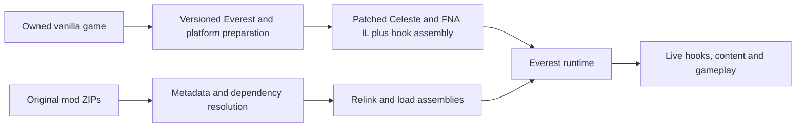
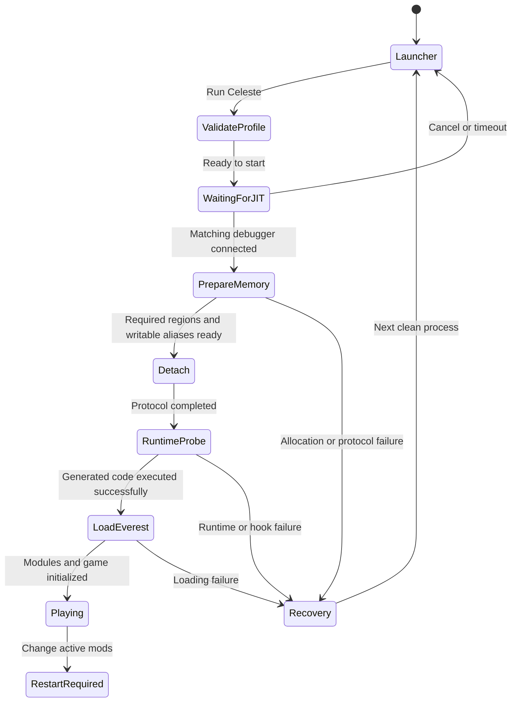
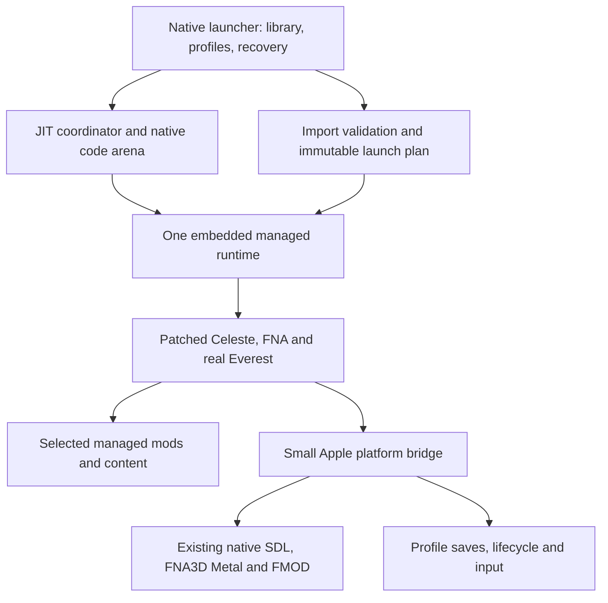

# Celeste Everest JIT for iOS: feasibility and architecture

## Decision

**Current implementation, 13 September 2026:** [build28 adds the native mod
browser](NATIVE_CATALOGUE_BUILD_28.md): sorted/category discovery, honest name
search, GameBanana details and exact-file reviewed installation. It preserves
all201 accepted27 managed assemblies, native runtime/renderer and existing
profiles. Its local/phone handoff states are tracked in the linked report and
evidence ledger. Build27 remains the physically accepted fallback. After phone28
acceptance, the next increment is responsive real startup progress.

**Current physical result, 13 September 2026:** [build27 passes actual
Everest1.6531.0, both newly eligible helper updates/reports, SJ gameplay,
resume, Quit and fresh-process save reload](BUILD_27_RUNTIME_ACCEPTANCE.md).
ExtendedVariantMode0.51.0 and MaxHelpingHand1.40.10 run with53 enabled ZIPs;
Cassette Cliffs room4→room5 and the next process's room5/counter969 reload pass.
No runtime failures are recorded. Build27 is the current accepted fallback;
native catalogue discovery/install was approved and implemented as28, followed by responsive loading,
whole-profile saves/settings and the touch editor. Preserve26/24 as well.

**Earlier physical result, 13 September 2026:** [build26 passes fresh Spring
dependency installation, reports, ARM64 reflection, gameplay, resume, Quit and
fresh-process saved-room reload](BUILD_26_INSTALLS_ACCEPTANCE.md). Seventeen
helpers installed successfully, AdventureHelper's enable-only report is correct,
and three processes record sidecar 0→65→167→168 with the last reloading Starjump's
strawberry room. No runtime failures were recorded. Build26 is the current
accepted fallback from that review. The [completed runtime assessment](EVEREST_RUNTIME_UPGRADE_ASSESSMENT_2026-09-13.md)
selected isolated stable Everest1.6531.0 and cache eligibility re-evaluation;
the later build27 implementation and acceptance above complete that step.

**Earlier physical result, 12 September 2026:** [build24 passes graphics,
background/resume, normal Quit and fresh-process save reload](BUILD_24_GRAPHICS_ACCEPTANCE.md).
The two recorded sessions played Cassette Cliffs, room3; the second loads the
first session's saved counter820. Earlier full original SJ dependency loading and
selected-map gameplay are accepted, without implying every mod/map works.
[Build25 adds native dependency installation and updates](MOD_INSTALLS_BUILD_25.md)
using the accepted game/runtime/renderer. Its small iCloud kit is confirmed
uploaded. Owner feedback identified confusing runtime warnings and missing earlier
release candidates. [Build26 corrects resolution and adds actual installation
reports](MOD_RESOLUTION_BUILD_26.md), with a scoped Mono reflection correction
for fresh dependency sets. Its final local gates and subsequent phone acceptance
pass as recorded above. Public original-IL packaging and FMOD permissions remain
separate gates. Earlier dated updates below are historical.

**Device update, 11 September 2026:** [native code execution now passes in the
owner's intended LiveContainer setup](NATIVE_EXECUTION_PASS_2026-09-11.md),
including code rewrites, worker-thread execution and background/return. This
establishes the native memory gate in this configuration. The original research
snapshot below is otherwise unchanged; later runtime results are recorded next.

**Managed runtime update:** [build 6 passes the physical G1 canary](MANAGED_EXECUTION_PASS_2026-09-11.md):
all eight imported-DLL/Reflection.Emit, ABI, GC/exception and callback stages,
clean worker detach, PASS UI and same-process background/return under custom
Mono 8.0.28 ARM64 JIT. Direct USB retrieval of its persisted logs also works
without exporting.

**Hook implementation update:** [build 7 implements the real MonoMod Hook/ILHook
canary](HOOK_CANARY.md). Actual host Mono tests and the protected-alias bridge
regression pass; the unsigned IPA and external fixture are uploaded to iCloud
for physical ARM64 and background/resume testing. [The first build 7 phone test
found a native header-selection error; build 8 fixes that preparation mismatch](BUILD_7_PROTOCOL_AND_BUILD_8.md).
[Build 8 then passed 21 real hook assertions on the phone before exhausting
its code budget; build 9 raises that budget and is uploaded for retesting](BUILD_8_CAPACITY_AND_BUILD_9.md).
**[Build 9 now passes physical G2](HOOK_EXECUTION_PASS_2026-09-11.md):** all 42
hook assertions, clean worker detachments, and retained/new hooks after 65 seconds
in the background. Code reservations reached 13.3 MiB of 32 MiB. Game integration
is starting; gameplay, general mod compatibility and the broader stress matrix
remain unverified.

**Game integration update:** [build 10 implements a JIT FNA/Metal graphics bridge](GRAPHICS_BRIDGE_BUILD_10.md),
with an external graphics fixture, native frame/lifecycle ownership and a retained
render hook. Actual desktop Mono/FNA renders 540 Metal frames and returns cleanly.
The unsigned phone kit is ready for physical graphics/input/resume testing; it
contains no Celeste content or Everest game payload yet.

**Graphics correction:** [build 10 reached Metal readback, then exposed a native
callback-lifetime failure; build 11 corrects it](BUILD_10_GRAPHICS_CRASH_AND_BUILD_11.md).
The exact old fixture reproduces a released command buffer when the host drains
its callback pool. The paired renderer/FNA fix passes 539 frames, skipped-draw
recovery, reset and resume on the host; physical graphics retesting is required.

**[Physical graphics now passes on build 11](GRAPHICS_EXECUTION_PASS_2026-09-11.md):**
3,758 frames, actual touch, 53 seconds background and same-process return,
retained hook and clean shutdown. Celeste baseline integration is starting;
this graphics fixture is not Celeste/Everest gameplay acceptance.

**[Build 12 implements the real Celeste baseline](CELESTE_BASELINE_BUILD_12.md):**
the actual title/Prologue, reused iOS touch policy, FMOD, XML saves and a
Player.Jump hook pass on pinned host Mono, including resume and clean shutdown.
The private unsigned kit is ready for the first physical game test. The game
uses the accepted renderer/runtime pair, with a separate guest and save root.
No Everest or mod ZIP loader is included yet. See the linked evidence for
cloud delivery status and the distinction between host and phone acceptance.

**[Build 12 now passes physical Celeste gameplay](CELESTE_EXECUTION_PASS_2026-09-11.md):**
Prologue through Forsaken City, 6,455 level frames, 58 hooked jumps, FMOD, XML
saves, 34.829 seconds background/resume and clean shutdown. All 9,579 JIT
completions are owned; code reservations reached 9.50 MiB of 32 MiB. The exact
build/DLL/script/snapshot matches and delayed foreground liveness is captured.
Proceed to [real Everest preparation and normal mod ZIP loading, followed by
the Strawberry Jam Beginner lobby and Bing](EVEREST_INTEGRATION_NEXT.md).
Everest/SJ compatibility and their memory requirements remain to be measured.

**[Build 13 implements actual Everest and normal mod ZIPs](EVEREST_BUILD_13.md):**
original Celeste IL passes Everest conversion/patching and HookGen. Real ZIP
relinking, mod assembly contexts, normal/IL hooks, a custom map entity, native
Lua callback, FMOD, module save sidecars and resume pass on host Mono. The
unsigned 0.6.0 (13) kit is ready for physical testing with two small test mods.
It uses a new 64 MiB JIT budget and matching session script. Physical Everest,
LuaCutscenes and Strawberry Jam acceptance remain pending.

**Proceed with a separate, gated JIT prototype. A useful mod launcher is feasible in principle, but general Everest compatibility on native iOS is not yet demonstrated.** The critical work is porting a managed runtime and its hook backend, not building the ZIP picker.

Keep the existing vanilla iOS app fully AOT. Keep the current iOS/tvOS static-AOT Everest and Strawberry Jam project independent. For the new JIT app, retain native, precompiled graphics/audio/platform components and a native launcher, but initially run the hookable managed game, Everest, and mods in one JIT-capable runtime with their IL and metadata preserved. Revisit selective managed AOT after real hooks work. Reusing the existing full-AOT Celeste binary as the target of arbitrary downloaded mods is not a sound starting assumption.

Three findings drive this recommendation:

1. The project's pinned MonoMod already has ARM64 support, but its iOS system selection explicitly throws `NotImplementedException`. A real iOS backend is needed. Its pinned CoreCLR adapter also stops at .NET 9, so choosing a newer CoreCLR creates a second version-integration task. [4][5]
2. On the primary target, iPhone 15 Pro Max / iOS 26.5, plan for the iOS 26 executable-memory protocol. StikDebug supplies the debugger side; the app must prepare the regions used by its JIT and hooks. A script cannot add that allocator to an unmodified .NET runtime. [6][7]
3. There is relevant prior art beyond MeloNX: Webleste ports actual Everest/Strawberry Jam with custom Mono/MonoMod support, and Amethyst embeds a dynamic JVM behind an iOS launcher with iOS 26 memory adaptations. Neither establishes that an off-the-shelf native .NET JIT works here. [10][11][12]

**Implementation follow-up:** [a native memory probe and physical test kit](NATIVE_PROBE.md) now exist. Test executable memory first on the phone, then advance to a runtime canary that executes dynamically loaded C# and real `Hook`/`ILHook` cases under StikDebug and LiveContainer. The first probe contains no Celeste content or managed runtime. Do not start by porting all Strawberry Jam dependencies or building the final launcher UI.

## Evidence and current state

This audit captures source and local host evidence on 10 September 2026. The primary device information is owner-supplied; no code was run on that device during the audit. LiveContainer and StikDebug versions remain unspecified. Immutable revisions, inspected-file hashes, input results, and the compile-only receipt are in [EVIDENCE.json](EVIDENCE.json).

| Item | Observed state | Meaning |
| --- | --- | --- |
| This checkout | `Celeste-Everest-JIT-Apple-Platforms`, starting at `b65bedd20016dc3482d7702d7f0a9707bc2b1479` | Includes the later Beginner expansion audit and host reproducibility work |
| Local audit branch | `codex/ios-jit-feasibility-audit` | Created locally; no commit or push |
| Existing AOT checkout | `/Users/harrymcneill/Projects/celeste-ios`, observed at `be8546d4ae411cb491a0c3bbc4e5343ebf9c9651` | Read-only reference; separate `.git` directory |
| Remote | Both projects relate to `https://github.com/hmcneill46/celeste-ios.git` | A differently named folder is not a separate GitHub repository |
| Host | Intel `x86_64`; Xcode 26.6, build `17F113`, iPhoneOS SDK 26.5 | Xcode works with an explicit `DEVELOPER_DIR`; global selection remains Command Line Tools |
| .NET tools | No `dotnet` executable on the audit shell's PATH; desktop Mono 6.14.1 available | A project-local modern SDK/runtime build environment remains necessary |
| Supplied Mac game | Existing exact-input validator passed `itch-macos-fna-1.4.0.0`; Celeste 1.4.0.0 / FNA 21.3.5 | A valid user-owned base is available |
| Supplied Windows ZIP | 1,276 members; seven banks; Celeste/FNA hashes match the validated Mac assemblies | Directory/two-assembly check only, not complete Windows input acceptance |
| FMOD input | `fmodstudioapi11009ios-installer.dmg` present | Not mounted or freshly SDK-validated in this audit |
| JIT26 ABI experiment | Xcode cross-compiled and disassembled both arm64 breakpoint functions successfully | Compiler/layout proof only; no executable-memory or managed-JIT proof |

The validated Mac content has 1,216 files and 1,158,665,183 bytes. The full validation checks the repository's content identity, assembly identities, and absence of Everest modifications. Original game files were not altered. Private input evidence lives under `.build/ios-jit/audit/inputs/`.

The accepted modern iOS port uses .NET 10's Apple target, full AOT, full trimming and LLVM, with `UseInterpreter=false`. Its entry point calls `SDL_UIKitRunApp` and starts one Celeste/FNA runtime. It already has direct FNA3D Metal, FMOD, touch controls, controller support, lifecycle handling, and Files-based save/layout transfer. These are substantial reusable assets. This is the existing **Mono-based Apple full-AOT route**, not evidence that `PublishAot=true` NativeAOT is being used. [L1][L2]

The static Everest lane intentionally substitutes a bounded, precomputed compatibility implementation. Its original mod inputs do not make its device output a general runtime loader. The SJ evidence is for selected content and semantics: the audited package contains 128 maps, while the accepted selected SJ slice is the Beginner lobby plus Bing alongside regression controls. The subsequent expansion audit recommends The Squeeze and explicitly does not grant it gameplay acceptance. None of those results transfer automatically to a new JIT runtime. [L3][L4]

The compilation experiment is reproducible through [the protocol ABI experiment](../../experiments/ios-jit/protocol-abi/README.md). It confirms `x16`, `brk #0xf00d`, argument preservation and return instructions. It does not allocate executable memory, attach a debugger, instantiate .NET, load a mod, or create an IPA.

## How desktop Everest actually works

Olympus is the desktop installation and management experience; Everest is the in-game loader and API. Mods normally remain ordinary ZIPs in `Mods/`; folders are also supported for development. Importing intact ZIPs is therefore the right default for the iOS launcher. Users should not need an Apple-specific mod format. [1]

There are two distinct patching stages:

1. **Prepare the game.** The pinned MiniInstaller converts legacy managed inputs, applies Everest's MonoMod patches to Celeste and FNA, and generates the hook assembly. That establishes Everest's API, exposed game members, and `On.*`/`IL.*` surface. [2]
2. **Load selected mods.** Everest reads metadata, resolves dependencies, mounts assets, relinks older assemblies when necessary, loads code in assembly contexts, and initializes modules. Mods can then create live detours and IL hooks. [3]



The [pinned Everest project](https://github.com/EverestAPI/Everest/blob/4bbde91b8dbaaddef2ceec75ca0cd6d59b3b8d00/Celeste.Mod.mm/Celeste.Mod.mm.csproj) targets `net8.0`. Its [assembly loader](https://github.com/EverestAPI/Everest/blob/4bbde91b8dbaaddef2ceec75ca0cd6d59b3b8d00/Celeste.Mod.mm/Mod/Module/EverestModuleAssemblyContext.cs) uses `AssemblyLoadContext`, reads transformed DLLs from streams, and resolves dependencies between mod contexts. It also supports desktop native-library folders. A launcher that merely calls `Assembly.Load` on every DLL will miss this behavior and will not reproduce normal Everest compatibility.

Metadata can describe multiple modules in one archive. A map with no DLL of its own may still require many helper DLLs. Model **packages**, **modules**, and **profiles** separately: package SHA identifies imported bytes; module name/version identifies a dependency; profile identifies a chosen configuration. Preserve Everest's actual version/dependency rules, optional dependencies, duplicate handling and content precedence. Do not substitute “alphabetical DLL order” or a new generic semantic-version algorithm. [3][15]

Runtime relinking of IL is compatible with the proposed JIT architecture. Replacing signed native app binaries on the phone is a different operation. The initial implementation should prepare the base game on the Mac and support on-device mod import/relinking; moving the entire base-game installation pipeline onto the phone can follow later.

## References that best fit the problem

| Reference | Best use here | Boundary |
| --- | --- | --- |
| Pinned Everest and MonoMod | Loader semantics, API identity, module lifecycle, dependency/relink behavior, hook conformance | Desktop code needs an iOS adaptation |
| Webleste / `MercuryWorkshop/celeste-wasm` | Closest game-specific example: actual Everest, user-supplied assemblies, a custom runtime bridge, and SJ shown running | Browser/WASM execution, different graphics/audio environment; upstream reports are not iOS tests |
| `r58Playz/MonoMod` WASM fork | An alternative `IDetourFactory` backed by runtime-level IL changes | Uses custom runtime functions and known method restrictions; not a drop-in ARM64 backend |
| Amethyst-iOS / Pojav lineage | Native launcher → JIT preparation → embedded language runtime; runtime-specific code-cache changes and recovery UX | JVM/Java, not CLR/C#; README advice and source can differ in age |
| StikDebug/StikJIT | Authoritative app/debugger protocol, acquisition lifecycle and script interface | Enables execution conditions, not .NET compatibility |
| LiveContainer | Actual guest launch, JIT script selection, process identity and container behavior | Guest bundle identity does not confer host entitlements |
| MeloNX | Native/precompiled host with a separate dynamic code generator; dual mappings and platform integration | Its C# library uses NativeAOT; translated Switch code is what needs JIT |
| dotnet/runtime and Microsoft Apple runtime documentation | Runtime configuration, code-manager patch points and supported shipping modes | Shipping iOS configurations are not a ready native-JIT solution |

Webleste's loader patches and dynamically loads Celeste, while its MonoMod fork supplies `WasmDetourFactory` through a custom native `liba` interface. That is strong architectural precedent for adapting the backend beneath Everest rather than individually reimplementing every helper. The implementation has guarded/unsupported method cases, so “full support” in its README should not become an acceptance statement for this project. [10][11]

Amethyst's `JavaLauncher.m` refreshes JIT state, handles a universal-script extension, selects a mirrored code cache on iOS 26, then enters the JVM. This is a better lifecycle analogy than an emulator alone. Study the relationship between its runtime allocator and launch protocol, without copying JVM patches into Mono or automatically adopting its signal-handler behavior. [12]

MeloNX's `Ryujinx.Library.csproj` explicitly enables NativeAOT. Its dual-mapped allocator supports the emulator's emitted machine code. This demonstrates that AOT application components can coexist with a JIT code generator; it does **not** demonstrate runtime loading of arbitrary managed assemblies into NativeAOT. [9] Its inspected [license](https://git.ryujinx.app/projects/MeloNX/src/commit/6a1c15962e61f681feedd5cb5fa02d37d53679cd/LICENSE.txt) is GPLv3; treat it as a reference and keep any code reuse/licensing decision explicit.

Microsoft's newer CoreCLR-on-iOS work is also relevant, but it is based on ReadyToRun plus interpretation. `UseMonoRuntime=false` is not a supported “enable native JIT on iOS” switch. Likewise, `UseInterpreter=true` enables interpretation, not the requested managed JIT. [13][14]

## Runtime choice and the AOT boundary

The recommended first candidate is a **custom build of modern dotnet/Mono with a native iOS bootstrap and an iOS-specific hook backend**. It is a research choice, not a proven dependency. Modern Mono is preferable to beginning with the installed classic Mono 6.14, because current Everest expects modern .NET APIs and assembly contexts. Embedding, BCL selection, GC, exceptions, P/Invoke and the JIT allocator must work as a coherent versioned build.

| Approach | Assessment |
| --- | --- |
| Existing vanilla AOT app, unchanged | Preserve as the dependable vanilla product |
| Existing static-AOT Everest/SJ app | Preserve for curated, installed-at-build-time compatibility without JIT |
| Standard .NET iOS build with a project-property change | Insufficient for the requested runtime JIT and native hook behavior |
| Custom modern Mono + native launcher + JIT | First bounded prototype candidate; Apple runtime ancestry and explicit embedding are useful, but allocator/ABI integration is substantial |
| Custom CoreCLR with JIT restored/adapted for iOS | Credible alternate candidate if Mono proves impractical; adds runtime-version, hosting and MonoMod integration work |
| Interpreter with a custom IL detour backend inspired by Webleste | Research fallback for dynamic compatibility; a third execution approach, not the existing full-AOT lane and not a JIT performance claim |
| AOT Celeste plus arbitrary JIT mods in a second managed runtime | Reject as the initial architecture: incompatible object/type/GC ownership and unproven hook targets |

**Keep AOT where it fits immediately:** Swift/Objective-C/C/C++ launcher and bridge code, SDL, FNA3D/Metal, FMOD and other native dependencies. “Native” does not mean “JIT”: those components remain precompiled in either product.

**Initially preserve IL and avoid aggressive trimming in the managed JIT payload:** Celeste, the managed FNA surface, Everest, MonoMod, dynamically used dependencies and mods. Retain private members required by reflection and the original method structure as far as practical. Mods can hook FNA and framework methods too, so “only mod DLLs need JIT” is an unsafe rule.

Mixed AOT/JIT within one compatible runtime is a possible later optimization. It requires retaining metadata/IL, matching runtime/AOT formats, controlling inlining/direct calls, providing a valid interception path, and proving generic and original-call behavior. An inlined game method can bypass a detour even if the replacement method itself compiles successfully. The existing fully trimmed product cannot simply be treated as such a mixed-runtime image.

The two highest-risk integrations are independent:

- **Managed runtime:** bootstrap without early JIT before permission, dynamically load a previously unbundled DLL, generate and execute methods, handle generics/exceptions/GC, and allocate every executable stub correctly.
- **MonoMod backend:** detect iOS, supply the platform/ABI and executable-memory services, support patching and trampolines through writable/executable aliases, and preserve detour semantics. The pinned [native ARM64 helper targets](https://github.com/MonoMod/MonoMod/blob/dfc30a1506d37fb88a2c2be004f525205f46a24c/src/MonoMod.Core/Platforms/Architectures/arm64/BuildHelper.props) are Linux/macOS, so iOS native helper packaging also needs work. [4][16]

Keep a tested runtime/Everest/MonoMod/native-bridge tuple. Changing the runtime version without revisiting MonoMod's private runtime assumptions is not a routine package upgrade.

## iOS 26 JIT and LiveContainer

Treat the supplied A17 Pro device as requiring the modern protocol, then verify actual capabilities at runtime. LiveContainer documents an additional script requirement on iOS 26 with A15+/M2+ devices. Detecting TXM should allow an unknown result; a failed query must not silently select an older allocation path. [8][6]

The proposed launch states are:



This is the app-owned logical flow. LiveContainer can acquire JIT before it enters the guest launcher. The implementation must accept that order as well: complete the native handshake during startup when required, then show the launcher with a verified ready state. Do not assume the app controls when an external container starts its debugger.

The allocator design should use a bounded arena, with separate writable and executable addresses for the same code memory. All emitting components must use it: the CLR's JIT, dynamic methods, call/exception/generic trampolines, MonoMod and any native helper stubs. A code generator may calculate PC-relative addresses from the executable address even while writing through the writable address. Simply replacing one `mmap` call is unlikely to cover that contract.

The universal protocol supplies a prepare-region operation and a detach operation. The target passes its address/length in registers, and the script prepares or allocates the executable region. Prepare all initial regions before detaching. Later arena growth requires another successful preparation exchange or a controlled failure; do not execute from an unprepared allocation. [7]

The following are proposed acceptance requirements, not results of this audit:

- A native launcher remains usable without starting managed JIT. Avoid a managed static initializer that generates code before the JIT gate.
- Check debugger state before issuing a breakpoint. Also establish that the expected protocol is active: an arbitrary attached Xcode debugger is not the matching StikDebug script.
- Do not treat a callback, `CS_DEBUGGED`, or `RuntimeFeature.IsDynamicCodeSupported` alone as success. Execute and verify generated code after the exchange, then test the managed runtime and hooks separately.
- Preserve page alignment, W^X, instruction-cache coherence, unwind information, thread safety and ARM64 ABI rules. Treat pointer-authentication interactions as a test requirement, not something an x64 desktop test can close.
- Return actionable failures on timeout, wrong/missing script, allocation exhaustion or lost process state. Do not swallow every `SIGTRAP`/`SIGBUS` to keep a broken launch moving.
- Keep executable caches process-local initially. Persist ordinary relinked IL and metadata caches; do not assume native JIT addresses or bytes are reusable after process death.

For standalone installation, the debugger target is the signed app process. Inside LiveContainer, target the **actual process hosting the guest**, including a multitask/extension PID where applicable. `NSBundle.mainBundle` may describe the guest while entitlements belong to the executable hosting it. LiveContainer's implementation distinguishes ordinary guest and PID-based multitask launch. Prefer its existing JIT flow for the first container build; do not guess the host from the guest bundle identifier. [8][17]

The final host process needs debug eligibility (`get-task-allow`) under the chosen signing arrangement. Putting an entitlement plist in the guest ZIP does not grant it. macOS Hardened Runtime `allow-jit` instructions are not a substitute for the iOS protocol; Apple specifically notes that the macOS write-protection API is unavailable on iOS. [6][18]

Start with **external StikDebug**, keeping pairing records and tunnel configuration in that app. StikJIT's embedded-helper route requires a separate process because a process cannot safely debug itself. It adds extension/IPC work and LiveContainer packaging considerations without solving the managed runtime. It is a later convenience feature. If StikDebug itself runs inside LiveContainer, the official container flow requires another available container/process. [6][8]

JIT readiness belongs to a process lifetime. A normal suspend/resume may preserve it; termination or reboot requires re-establishment on the next run. Present “JIT ready for this launch,” not a permanent enabled setting.

## Product architecture

Use a new product tentatively named **Celeste Everest JIT**, with a separate bundle identifier such as `io.github.hmcneill46.celeste.everest.jit`. The identifier is a proposal, not a registered or packaged app. The first runtime canary should have a further `.probe` identity so it cannot replace either game product.



The launcher should be native Swift/Objective-C or an equally independent native surface so it can import files, show diagnostics and recover before the CLR starts. SwiftUI is a reasonable UI choice; it is not a requirement to rewrite working platform behavior in Swift.

Define a small, versioned C interface for runtime startup, paths, lifecycle, logging and native services. Exchange UTF-8 strings, byte buffers, plain structures and explicit handles across it. Keep game objects inside the chosen CLR. Reuse platform-neutral C# policies where possible; UIKit/Foundation bindings from the existing .NET Apple host are not automatically portable into a manually embedded CLR.

**Application ownership must be designed explicitly.** The existing app starts SDL's UIKit application from managed `Main`. The JIT product must have one UIKit application/scene lifecycle, one SDL handoff, one FNA game and one Celeste-owned FMOD system. Present the launcher within that lifecycle and defer managed/game entry. Do not start a second `UIApplicationMain`, invoke `SDL_UIKitRunApp` again from an already running launcher, or create an audio “preview” system beside Celeste. Establish the main-thread/render-loop contract in the first game integration probe. [L1]

Prepare the initial game payload using the original, validated game assembly and a pinned Everest patching pipeline. Add narrow iOS-specific adaptations with known ordering. Preserve method identities, private reflection surfaces and IL patterns used by helpers. The decompiled/recompiled static-AOT output is a valuable reference for platform changes, but it should not silently become the authoritative dynamic-mod input.

Carry forward these platform adaptations deliberately:

| Area | Reuse strategy |
| --- | --- |
| Metal/SDL/native dependencies | Rebuild or consume the existing pinned iOS sources/locks into JIT-owned outputs; verify device platform and exported symbols |
| Managed FNA | Build an appropriate managed target with the same necessary iOS fixes and stable assembly identity; test Everest's FNA patches too |
| Touch/controllers | Reuse logical-input policies, touch layout semantics and artwork; bind native events once; add mod-specific bindings when needed |
| Audio | Keep the accepted FMOD path initially; test mod banks separately and retain one FMOD owner |
| Saves | Reuse atomic file/backup primitives; implement full Everest file semantics separately from the static facade's bounded schemas |
| Lifecycle | Preserve pause/resume, audio interruptions, haptics clearing and save coordination |
| Desktop features | Adapt paths, splash/restart/exit behavior, file opening and native-library resolution; disable unavailable Steam/Discord/process-launch paths |

Keep built-in Everest/runtime updates out of the first product. Native runtime updates require a new IPA. A mod-library updater can be added later as an explicit action that creates a new profile revision and keeps rollback data. GameBanana/Olympus-style dependency downloads are useful later, but ZIP import alone is enough for the first launcher.

Native dependencies are not made portable by JIT. A helper depending on Windows DLLs, macOS dylibs, unsupported sockets/process behavior or architecture-specific code still needs adaptation. Bundled iOS native dependencies must be built and signed appropriately. Plain Lua may be supportable through a ported bundled interpreter; LuaJIT would introduce another executable allocator. Neither should be promised for the first release.

## App flow and mod management

The intended interaction is **open launcher → import mod ZIPs → choose an enabled profile → Run Celeste**. “Import” means copy into app storage, not upload to a server.

1. **First launch:** display the game/runtime version and create a default profile. The first private self-build can bundle the validated, prepatched base and content. A later distributable launcher can import a supported owned-game ZIP and prepare it locally; that is an additional feature with storage/progress/recovery work.
2. **Import mods:** use Files/share-sheet document access, copy into a staging area, stream hashes and validate metadata/archive structure. Show name/version, dependencies, code/content classification and disk cost. Large imports need progress and cancellation.
3. **Resolve the profile:** show missing or incompatible dependencies, duplicates and unsupported platform dependencies. Allow importing the required ZIPs. A syntactically valid DLL gets “unverified compatibility,” not a green gameplay promise.
4. **Enable/disable:** a mod selection applies to the next launch. Include required dependencies or clearly explain what is missing. Optional dependencies follow Everest's semantics. Updating a package should not overwrite the last working bytes.
5. **Run:** freeze the selected package hashes and runtime tuple; verify free space, previous interrupted launch and JIT readiness; then start Everest. Show meaningful progress for relinking, assets, modules and game startup.
6. **Play:** retain the existing touch/controller experience and save behavior. Mod options and additional bindings should use Everest's normal model where possible.
7. **Change the mod set:** finish saving and require a clean runtime/process launch. In the first release, returning to the game menu does not mean that assemblies, hooks or static state have unloaded safely.
8. **Recover:** on the next launch, an unfinished session marker offers launcher-only recovery, last working profile, logs and backups. Describe an unclean ending as “interrupted”; iOS termination or memory pressure is not proof that the last mod caused a crash.

Do not promise hot-swapping between vanilla AOT and modded JIT inside one running process. The vanilla product remains a separate dependable app. An empty-mod Everest profile can be useful for diagnosing the JIT product, but it is still running the Everest/JIT game and is not identical to the vanilla AOT build.

Launching a second iOS executable as if it were a desktop child process is not the intended design. Mod selection precedes the one game session in the host process. A fully polished return-to-launcher/relaunch path can follow after runtime teardown and container behavior have been demonstrated; the first version can require closing and reopening through LiveContainer.

## Storage, imports and recovery

Use a private Application Support root distinct from both existing products. One proposed layout is:

```text
Library/Application Support/CelesteEverestJIT/
  Library/<package-sha256>.zip
  Profiles/<profile-id>/profile.json
  Profiles/<profile-id>/Saves/
  Profiles/<profile-id>/Backups/
  Launches/<launch-id>/manifest.json
  Launches/<launch-id>/Mods/
  Launches/<launch-id>/session.json
Library/Caches/CelesteEverestJIT/
  Relink/<runtime-and-base-and-profile-key>/
  ImportStaging/
Documents/Exports/
```

The profile records requested modules, exact chosen package hashes, runtime/base identities and an active configuration revision. Everest's resolved runtime order remains the authority. Either materialize a stable view of the selected ZIPs or implement an adapter that exposes equivalent loader paths; do not mutate a currently running `Mods/` directory. APFS cloning/copy optimization is optional and must preserve the same semantics if unavailable.

Retain source ZIPs and backups outside purgeable caches. A relink cache key should include game/Everest/MonoMod/runtime/platform-patch versions and the relevant mod/dependency bytes. Cache corruption or a changed key triggers regeneration. Do not cache a positive compatibility result by filename alone.

The importer needs meaningful validation even though mods ultimately run code: reject traversal/absolute paths, symlinks, duplicate normalized names, case/Unicode collisions, encrypted or unsupported archives, excessive expanded sizes/entry counts, and invalid metadata. Bound YAML parsing and decompression; do not load a DLL merely to display its metadata. Reject or explain an extra enclosing directory rather than silently changing package meaning. Keep thresholds configurable in engineering policy and measure SJ before fixing overly small limits.

A successful import is atomic: interrupted copies remain staging files and cannot become enabled packages. Ensure enough room for the imported archive, relinking/extraction scratch space, backups and replacement data. For multi-gigabyte mod sets, measure resident memory separately from compressed ZIP size; textures, decoded audio, metadata and code caches can dominate.

Keep complete profile-specific Everest save/settings/session files and sidecars, including module-defined data. The current static lane's bounded allowlist and generated serializers are not sufficient for arbitrary mods. Where modules use their own files, preserve those files in the profile backup scope and record any unsupported path behavior. [19]

Vanilla-to-JIT transfer should be a deliberate **copy** through the existing export/import flow with a backup. Never make both apps live-write the same save directory. Modded saves may contain fields/state unavailable to vanilla or to a different dependency graph; do not silently round-trip them into the AOT app. Reuse checksummed generations and atomic replacement ideas while retaining normal Everest file semantics.

Imported code mods share the runtime and process. The launcher can validate packages and isolate configurations, but should not claim a per-mod security sandbox. Provide a concise trust explanation in the import experience and an exportable diagnostic log with private paths/identifiers redacted; do not introduce telemetry as a prerequisite.

## Git and build isolation

Keep the existing two checkouts. This project already has a local audit branch and independent Git metadata. There is no need to move, reset, rebase or create a worktree from the actively developed AOT directory. No existing AOT source, builder, version authority or dependency lock was edited in this audit.

The preferred longer-term arrangement is **one repository with separate product directories and a dedicated JIT development branch**, integrating shared fixes deliberately. A separate GitHub repository is possible, but creates more ongoing synchronization work; the folder name alone has not created one. Do not create a remote, change `origin`, or publish a branch without the owner's approval.

| Concern | JIT rule |
| --- | --- |
| Branches | Continue from this audit on a `codex/` feature branch; a dedicated JIT integration branch can be named when development starts |
| Source | Proposed `jit-ios/` product and bridge code; `experiments/ios-jit/` for bounded probes |
| Build output | `.build/ios-jit/` exclusively; never use the active AOT checkout's generated trees |
| Deliverables | `artifacts/ios-jit/` exclusively |
| Runtime/SDK | Separate pinned tool root and product-local `global.json`; do not change the repository's AOT SDK pin to test a JIT runtime |
| NuGet/Xcode | Explicit SDK executable, CLI/package directories and `DEVELOPER_DIR`; no global workload/Xcode switching as a build shortcut |
| Version/bundle ID | JIT-specific version authority and identity; do not increment vanilla or AOT-canary versions |
| Shared changes | Small platform fixes with narrow diffs; transfer by reviewed cherry-pick/patch once authorized |
| CI | Separate opt-in JIT workflow/job/output names; preserve vanilla/static-AOT checks and avoid release/tag triggers |
| Third-party code | Pin source commits and patches independently; keep downloaded trees under ignored roots until a reviewed vendoring/submodule decision |

Both products can reuse native source/locks, but **not mutable build directories**. Modern iOS projects contain fixed output/staging paths, and the foundation project generates build identity under its own `obj/`. A new JIT target must either provide fully isolated intermediate paths or reuse selected source in its own project. A direct project reference is not automatically output-isolated. [L2]

Do not bulk-merge the AOT lane's generated facade/lowerings into JIT. If both lanes need a touch or FMOD fix, extract a small shared primitive only when its behavior is understood in both. Keep source-neutral tests for those primitives and separate physical acceptance for each executable.

The tracked additions from this audit are documentation, `AGENTS.md`, ignored JIT output roots and the compile-only ABI experiment. All fetched references and private game evidence are under `.build/ios-jit/`. No game source/assets, FMOD SDK payload, signing material or pairing records are added to tracked files. No Git commit or GitHub write was made.

## Development milestones and acceptance

These gates intentionally put the most uncertain work first. A build success, a JIT status flag, and a map's title screen are different levels of evidence.

| Gate | Deliverable | Required evidence before advancing |
| --- | --- | --- |
| G0: Native execution | Standalone unsigned native probe IPA and matching script, no game content | On iPhone 15 Pro Max / iOS 26.5: valid prepared code arena, write through alias, execute from RX, update/invalidate, detach and execute; missing/wrong script recovers safely |
| G1: Managed runtime | Pinned embedded runtime canary | Load a DLL imported after the app was built; execute its method and an emitted dynamic method; prove native managed-code compilation rather than interpreter fallback |
| G2: Hook backend | iOS MonoMod adapter and conformance canary | Actual `Hook`, generated `On` hooks and `ILHook` modify calls and restore them; original delegates, ordering, lifetime and exceptions behave correctly |
| G3: Game baseline | Celeste+Everest iOS product with no external mods | First frame, vanilla chapters through Everest, direct Metal, touch/controller, audio, lifecycle and save/reload; no desktop process/native dependencies |
| G4: Useful mods | ZIP import + dependency/profile MVP | Content-only map, a simple code helper, an IL-hook helper and a multi-helper map; actionable missing-dependency errors and repeatable clean relaunch |
| G5: SJ compatibility | Exact pinned SJ graph | Lobby/Bing first for comparison, then helper-mechanism and chapter coverage; audio, custom entities, deaths, transitions, cutscenes and persistence on the actual graph |
| G6: Product hardening | Recoverable launcher, backups and repeatable unsigned packaging | Corrupt/missing packages, interrupted import, memory pressure, cancellation, lifecycle and replacement install; clean unsigned package plus tested signing/container instructions |
| G7: Optimization | Optional selective AOT/runtime tuning | Measured benefit on identical content with G1–G6 regression coverage; retain correct hooks and explicitly label interpreter execution if introduced |

The initial audit completes **none of G0–G7**. The compile-only interface check is preparatory evidence for G0. The subsequent [native probe implementation](NATIVE_PROBE.md) provides an unsigned IPA and matching per-launch script; its host/mock/simulator checks do not complete physical G0 acceptance.

The later [build 2 physical result](NATIVE_EXECUTION_PASS_2026-09-11.md)
establishes G0's successful native-execution path in the intended LiveContainer
configuration. The standalone, reboot and device failure-path portions of the
broader test matrix remain open. This is sufficient evidence to begin G1,
without claiming that the entire G0 matrix or any managed-runtime gate passes.

G1 needs more than an arithmetic demo. Cover an unseen generic instantiation, struct and floating-point arguments/returns, reflection-created instances, delegate and reverse-P/Invoke callbacks, managed exceptions across the native boundary, a background managed thread and forced GC while delegates remain callable. Log the runtime build/commit and whether generated managed methods actually reach the JIT compiler. Success must not be explained solely by precompiled fixtures.

G2 should use the existing desktop hook-ordering/conformance work as a behavioral oracle, without using its static device replacements. Test add/remove/re-add, two hooks in each order, original-call chains, direct hooks, IL rewrites, virtual/instance methods, generic cases, exceptions and GC. Check effects when a target was previously called/JIT-compiled and when a helper hooks it later. Test code-arena exhaustion and additional trampolines after debugger detach. CoreCLR tiering/recompilation, if used, requires separate coverage.

Run G0/G1/G2 both in a standalone signed installation and in the intended LiveContainer configuration. The standalone route isolates container problems. Neither grants the other a PASS. Include fresh process launch, device reboot, ordinary background/foreground, script cancellation, wrong script, unsupported signing and successful re-entry after an interrupted attempt.

SJ should be the later **integration test**, not the first runtime test. Start with the exact known 1.0.12 inputs and their pinned dependency graph, then expand to newer versions explicitly. Once actual helper code runs, the JIT lane can avoid many AOT map-specific lowerings, but platform APIs, obsolete dependency versions, hook ABI assumptions and memory pressure can still fail. Full SJ compatibility remains an acceptance program, not a consequence of passing the lobby.

For planning, allow a focused **5–10 engineering-day first investigation** into G0/G1 and the first real hook; use that to decide whether to continue with Mono, change to CoreCLR, or examine the IL-detour fallback. This is a proposed timebox, not an estimated completion guarantee. A usable launcher plus broad mod compatibility is plausibly a multi-week to multi-month project; a dependable schedule is premature before the runtime/hook gates. UI work can proceed independently only once it will not conceal an unresolved runtime decision.

## Performance expectations

There is no basis yet to conclude that the JIT game will be slower overall. AOT and JIT both ultimately execute native machine code. JIT can increase startup cost and code/metadata memory, while runtime optimization may help some workloads; hooks can inhibit optimizations in either mode. Graphics/audio remain the same native systems. The extra work from SJ itself can outweigh the compilation-mode difference.

The vanilla AOT app may have excellent startup and memory behavior. The static-AOT SJ implementation and the full helper code may do different amounts of work, so compare identical accepted scenes and disclose semantic differences. Do not compare a bounded AOT slice against an entire JIT collab and attribute all differences to JIT.

Measure the following on the primary phone, then on an explicitly chosen older phone:

| Measurement | Comparison method |
| --- | --- |
| Cold/warm launch | Separate JIT acquisition, runtime initialization, relinking and asset loading; persistent IL cache does not mean persistent native JIT |
| Frame delivery | Median, p95/p99 frame time, worst stalls and missed 16.67 ms budgets during fixed 60 Hz scenes |
| First-use compilation | First entry versus repeated entry, death/respawn and helper activation |
| Memory | Peak resident memory, code-arena use, decoded textures/audio, allocation/GC pressure and memory-termination evidence |
| Sustained behavior | Fixed scenes for 15–30 minutes, thermal state, battery/energy observations and audio stability |
| Functional parity | Inputs, transition timing, save state and outcomes alongside performance metrics |

Use the same device, content bytes, resolution, frame cap and comparable settings. Record signing/container/memory entitlement conditions. Do not copy MeloNX's memory-entitlement requirements or code-cache sizes into Celeste without measurement. Older hardware might run well with native JIT, or fail primarily because of SJ memory use; both remain open.

## Future IPA and StikDebug handoff

**No IPA or product-ready Celeste JIT script exists from this audit.** The files under the ignored reference trees are research inputs, not a tested installation bundle. Do not install an unrelated MeloNX/Amethyst script and assume it matches a future CLR allocator.

When G0 or a later gate produces an installable build, deliver it under this project's absolute output root:

```text
/Users/harrymcneill/Projects/Celeste-Everest-JIT-Apple-Platforms/artifacts/ios-jit/<build-id>/
  CelesteJITProbe-<version>-unsigned.ipa       (early runtime gates)
  CelesteEverestJIT-<version>-unsigned.ipa     (game gates)
  universal.js                              (if this is the tested protocol)
  INSTALL.md
  SHA256SUMS
  build-receipt.json
  THIRD-PARTY-NOTICES.txt
```

Only emit the IPA appropriate to that build. If a custom script is necessary, give it a product/versioned filename and record its protocol/hash with the runtime. Pin the exact bytes even when the script is the upstream universal script. Include script redistribution notices. Never label a script tested just because the app uses the expected breakpoint immediate.

The builder must verify conventional `Payload/<App>.app` packaging, iOS arm64 Mach-O platform, minimum OS, library install names/resolution, expected native/managed payloads and the absence of personal signatures/provisioning in the unsigned artifact. Use an explicit unsigned linker/signing route: merely renaming an archive or removing `embedded.mobileprovision` is insufficient. Report whether any Mach-O retains an ad-hoc signature rather than conflating ad-hoc and unsigned. Validate actual entitlements after the chosen installer signs the real host process.

Expected **future** LiveContainer instructions, to be verified and versioned with the artifact:

1. Import the supplied unsigned IPA into LiveContainer using its normal install/signing workflow.
2. Configure StikDebug and its pairing/DDI/tunnel prerequisites according to the tested versions. Keep the pairing record out of this project and the app's diagnostic exports.
3. Select StikDebug as LiveContainer's JIT enabler. If StikDebug is container-hosted, use its documented “Another LiveContainer” arrangement.
4. Hold the Celeste entry, open its settings, enable **Launch with JIT**, and select the exact supplied **JIT Launch Script**. These controls exist in the current documented container flow. [8]
5. Launch through LiveContainer and complete its JIT flow for the correct process. Then verify the app reports successful runtime preparation; an external “JIT enabled” message alone is insufficient.
6. Import the desired mod ZIPs, resolve the profile, and select **Run Celeste**. Preserve the base game's required files if the build uses first-run import instead of private bundling.
7. For an interrupted launch, return to the recovery launcher on a fresh process. Export logs/backups and switch to the last working profile. If Files import fails inside the container, test its documented File Picker fix and record that requirement. [20]

JIT setup should not require the user to author a shell/JavaScript script. The developer provides one matching the built runtime. The first install instructions must include exact tested app/container/debugger/iOS versions, actual IPA/script paths and checksums, whether the build contains a game or only a probe, and what remains untested.

Personal game-containing IPAs should stay private. A public launcher must have an owned-game import/preparation story and an appropriate dependency/licensing inventory. This audit does not authorize GitHub publication or distribution of the supplied game/FMOD inputs.

Every physical test handoff should provide a build/script checksum, exact reproduction steps, expected visible behavior and an inspectable diagnostic bundle. Begin logging in native startup before the CLR exists, then record the runtime, hook and loader stages with the same launch identifier. The recovery launcher should export persistent logs through Files/share UI. For native failures before export is possible, capture the actual host process through Console/device crash logs. Avoid attaching Xcode while StikDebug needs exclusive debugger control; use non-attaching log capture for that test. Record owner-reported observations separately from logs and preserve the exact versions with the result.

## Outstanding decisions

The runtime family/version becomes a decision after G1/G2, not before. The initial evidence favors trying modern Mono, with CoreCLR as a defined alternative. Whether a native-code or runtime-level IL detour implementation is more maintainable should be judged against real hook conformance and device behavior.

The exact LiveContainer and StikDebug versions, signing arrangement and supported older-device floor remain to be recorded. The known target is iPhone 15 Pro Max on iOS 26.5. tvOS JIT is not included in the initial product: an iPhone StikDebug/LiveContainer workflow is not evidence of an equivalent tvOS workflow. Preserve the existing AOT tvOS product and assess a JIT tvOS target separately if requested.

The initial game integration should retain the existing native audio/version contract, then explicitly test more mod banks. A higher FMOD version, Lua, automatic dependency downloads, same-process mod reload, bundled vanilla/JIT switching and selective managed AOT are later decisions with their own evidence requirements.

## Sources

Repository sources are pinned to the exact inspected revision in [EVIDENCE.json](EVIDENCE.json), including commit dates and individual file SHA-256 values. The linked revisions below avoid treating moving `main` branches as reproducible build inputs. External documentation was checked on 10 September 2026; it can change independently of the pinned implementations.

1. Everest team, [Everest website and installation guidance](https://everestapi.github.io/). ZIP workflow and Olympus/runtime distinction.
2. Everest team, [pinned MiniInstaller](https://github.com/EverestAPI/Everest/blob/4bbde91b8dbaaddef2ceec75ca0cd6d59b3b8d00/MiniInstaller/Program.cs). Base conversion, patching and HookGen sequence.
3. Everest team, pinned [loader](https://github.com/EverestAPI/Everest/blob/4bbde91b8dbaaddef2ceec75ca0cd6d59b3b8d00/Celeste.Mod.mm/Mod/Everest/Everest.Loader.cs), [assembly contexts](https://github.com/EverestAPI/Everest/blob/4bbde91b8dbaaddef2ceec75ca0cd6d59b3b8d00/Celeste.Mod.mm/Mod/Module/EverestModuleAssemblyContext.cs), [relinker](https://github.com/EverestAPI/Everest/blob/4bbde91b8dbaaddef2ceec75ca0cd6d59b3b8d00/Celeste.Mod.mm/Mod/Everest/Everest.Relinker.cs) and [project](https://github.com/EverestAPI/Everest/blob/4bbde91b8dbaaddef2ceec75ca0cd6d59b3b8d00/Celeste.Mod.mm/Celeste.Mod.mm.csproj). Runtime loading, resolution and net8.0 target.
4. MonoMod contributors, [pinned PlatformTriple](https://github.com/MonoMod/MonoMod/blob/dfc30a1506d37fb88a2c2be004f525205f46a24c/src/MonoMod.Core/Platforms/PlatformTriple.cs#L65-L96). ARM64 implementation and explicit iOS gap.
5. MonoMod contributors, [CoreBaseRuntime](https://github.com/MonoMod/MonoMod/blob/dfc30a1506d37fb88a2c2be004f525205f46a24c/src/MonoMod.Core/Platforms/Runtimes/CoreBaseRuntime.cs) and [ARM64 helper targets](https://github.com/MonoMod/MonoMod/blob/dfc30a1506d37fb88a2c2be004f525205f46a24c/src/MonoMod.Core/Platforms/Architectures/arm64/BuildHelper.props). Runtime-version dispatch and helper build platforms.
6. StikDebug contributors, [StikJIT integration guide](https://github.com/StikDebug/StikJIT/blob/3623e725876f76aecb0520582ad6194bacb15d39/INTEGRATION.md) and [TXM detection](https://github.com/StikDebug/StikJIT/blob/3623e725876f76aecb0520582ad6194bacb15d39/Sources/ProcessInfo%2BTXM.swift). Debugger/host responsibilities and helper-process design.
7. StikDebug contributors, [universal protocol implementation](https://github.com/StikDebug/StikJIT/blob/3623e725876f76aecb0520582ad6194bacb15d39/Resources/universal.js). Breakpoint ABI and region preparation.
8. LiveContainer contributors, [JIT Support](https://livecontainer.github.io/docs/guides/jit-support). Hardware/script requirements, launch flow and container-hosted StikDebug.
9. MeloNX contributors, [source repository](https://git.ryujinx.app/projects/MeloNX), pinned [managed library project](https://git.ryujinx.app/projects/MeloNX/src/commit/6a1c15962e61f681feedd5cb5fa02d37d53679cd/src/Ryujinx.Library/Ryujinx.Library.csproj) and [dual-mapped allocator](https://git.ryujinx.app/projects/MeloNX/src/commit/6a1c15962e61f681feedd5cb5fa02d37d53679cd/src/Ryujinx.Memory/DualMappedJitAllocator.cs). NativeAOT host versus guest-code JIT. The web landing page presented a bot-check response; the source was successfully read through the repository's normal Git transport.
10. Mercury Workshop, [Webleste README](https://github.com/MercuryWorkshop/celeste-wasm/blob/b4b19eb24a8499e4de96aee79f1272ffdb57281f/README.md), [loader](https://github.com/MercuryWorkshop/celeste-wasm/blob/b4b19eb24a8499e4de96aee79f1272ffdb57281f/loader/Celeste.cs) and [patcher](https://github.com/MercuryWorkshop/celeste-wasm/blob/b4b19eb24a8499e4de96aee79f1272ffdb57281f/loader/Patcher.cs). Game-specific prior art. See also the authors' [porting account](https://velzie.rip/blog/celeste-wasm).
11. r58Playz and contributors, [WasmDetourFactory](https://github.com/r58Playz/MonoMod/blob/8e904f7979c9423982c1f786ba57fdb22a5556d2/src/MonoMod.Core/Platforms/WasmDetourFactory.cs) and [FNA-WASM-Build](https://github.com/r58Playz/FNA-WASM-Build). Runtime-assisted detours and integration.
12. AngelAuraMC contributors, [Amethyst JavaLauncher](https://github.com/AngelAuraMC/Amethyst-iOS/blob/9212a1894865e7ac0466029e25ddb0d895544c76/Natives/JavaLauncher.m) and [script extension](https://github.com/AngelAuraMC/Amethyst-iOS/blob/9212a1894865e7ac0466029e25ddb0d895544c76/Natives/resources/UniversalJIT26Extension.js). JIT preparation before JVM entry and mirrored code cache.
13. Microsoft, [Mono interpreter on iOS and Mac Catalyst](https://learn.microsoft.com/en-us/dotnet/maui/macios/interpreter?view=net-maui-10.0). AOT/interpreter behavior; interpreter is not native JIT.
14. Microsoft, [Runtimes and compilation](https://learn.microsoft.com/en-us/dotnet/maui/deployment/runtimes-compilation?view=net-maui-10.0) and [CoreCLR Apple-mobile tracking issue](https://github.com/dotnet/runtime/issues/120042). CoreCLR R2R/interpreter direction, not supported iOS native JIT.
15. Everest team, [Mod Structure](https://github.com/EverestAPI/Resources/wiki/Mod-Structure) and [Mod Setup](https://github.com/EverestAPI/Resources/wiki/Mod-Setup). Metadata and package conventions.
16. dotnet/runtime contributors, [Mono code manager](https://github.com/dotnet/runtime/blob/798449390515fa02f4b20160bedc5e34f8fbdfb9/src/mono/mono/utils/mono-codeman.c), [memory mappings](https://github.com/dotnet/runtime/blob/798449390515fa02f4b20160bedc5e34f8fbdfb9/src/mono/mono/utils/mono-mmap.c), and [JIT build option](https://github.com/dotnet/runtime/blob/798449390515fa02f4b20160bedc5e34f8fbdfb9/src/mono/cmake/options.cmake). Candidate investigation points, not a selected product runtime.
17. LiveContainer contributors, [guest launch model](https://github.com/LiveContainer/LiveContainer/blob/3afa9eb9a53625e9b8bd8b932e5785fd716ad5ae/LiveContainerSwiftUI/Models/LCAppModel.swift) and [README](https://github.com/LiveContainer/LiveContainer/blob/3afa9eb9a53625e9b8bd8b932e5785fd716ad5ae/README.md). PID-based launch and guest hosting.
18. Apple, [Porting just-in-time compilers to Apple silicon](https://developer.apple.com/documentation/apple-silicon/porting-just-in-time-compilers-to-apple-silicon). macOS/iOS API boundary.
19. Everest team, [module persistence](https://github.com/EverestAPI/Everest/blob/4bbde91b8dbaaddef2ceec75ca0cd6d59b3b8d00/Celeste.Mod.mm/Mod/Module/EverestModule.cs) and [UserIO patch](https://github.com/EverestAPI/Everest/blob/4bbde91b8dbaaddef2ceec75ca0cd6d59b3b8d00/Celeste.Mod.mm/Patches/UserIO.cs). Extended saves, module settings and sidecars.
20. LiveContainer contributors, [App Settings](https://livecontainer.github.io/docs/guides/app-settings). Script selection and file-picker settings.

Local authorities:

- L1: [Current status](../STATUS.md), [iOS architecture](../IOS_FOUNDATION.md), and [entry point](../../modern-ios/CelesteIOSRuntimeHost/Program.cs).
- L2: [iOS host project](../../modern-ios/CelesteIOSRuntimeHost/CelesteIOSRuntimeHost.csproj), [FNA project](../../modern-ios/FNA.iOS/FNA.iOS.csproj), [foundation project](../../modern-ios/CelesteIOSFoundation/CelesteIOSFoundation.csproj), [SDK pin](../../global.json), [input profiles](../../managed/celeste-input-profiles.json), and [host reproducibility](../APPLE_AOT_HOST_VERIFICATION.md).
- L3: [Static-AOT architecture](../APPLE_EVEREST_STATIC_AOT.md), [compatibility](../APPLE_EVEREST_COMPATIBILITY.md), and [pinned Everest profile](../../apple-everest/profiles/stable-1.6458.0.json).
- L4: [Beginner expansion audit](../history/stages/APPLE_EVEREST_BEGINNER_EXPANSION_AUDIT_STAGE25KM_REPORT.md) and [first SJ slice outcome](../history/stages/APPLE_EVEREST_FIRST_SJ_SLICE_OUTCOME_STAGE25KL_REPORT.md).

[1]: https://everestapi.github.io/
[2]: https://github.com/EverestAPI/Everest/blob/4bbde91b8dbaaddef2ceec75ca0cd6d59b3b8d00/MiniInstaller/Program.cs
[3]: https://github.com/EverestAPI/Everest/blob/4bbde91b8dbaaddef2ceec75ca0cd6d59b3b8d00/Celeste.Mod.mm/Mod/Everest/Everest.Loader.cs
[4]: https://github.com/MonoMod/MonoMod/blob/dfc30a1506d37fb88a2c2be004f525205f46a24c/src/MonoMod.Core/Platforms/PlatformTriple.cs
[5]: https://github.com/MonoMod/MonoMod/blob/dfc30a1506d37fb88a2c2be004f525205f46a24c/src/MonoMod.Core/Platforms/Runtimes/CoreBaseRuntime.cs
[6]: https://github.com/StikDebug/StikJIT/blob/3623e725876f76aecb0520582ad6194bacb15d39/INTEGRATION.md
[7]: https://github.com/StikDebug/StikJIT/blob/3623e725876f76aecb0520582ad6194bacb15d39/Resources/universal.js
[8]: https://livecontainer.github.io/docs/guides/jit-support
[9]: https://git.ryujinx.app/projects/MeloNX/src/commit/6a1c15962e61f681feedd5cb5fa02d37d53679cd/src/Ryujinx.Library/Ryujinx.Library.csproj
[10]: https://github.com/MercuryWorkshop/celeste-wasm/blob/b4b19eb24a8499e4de96aee79f1272ffdb57281f/README.md
[11]: https://github.com/r58Playz/MonoMod/blob/8e904f7979c9423982c1f786ba57fdb22a5556d2/src/MonoMod.Core/Platforms/WasmDetourFactory.cs
[12]: https://github.com/AngelAuraMC/Amethyst-iOS/blob/9212a1894865e7ac0466029e25ddb0d895544c76/Natives/JavaLauncher.m
[13]: https://learn.microsoft.com/en-us/dotnet/maui/macios/interpreter?view=net-maui-10.0
[14]: https://learn.microsoft.com/en-us/dotnet/maui/deployment/runtimes-compilation?view=net-maui-10.0
[15]: https://github.com/EverestAPI/Resources/wiki/Mod-Structure
[16]: https://github.com/dotnet/runtime/blob/798449390515fa02f4b20160bedc5e34f8fbdfb9/src/mono/mono/utils/mono-codeman.c
[17]: https://github.com/LiveContainer/LiveContainer/blob/3afa9eb9a53625e9b8bd8b932e5785fd716ad5ae/LiveContainerSwiftUI/Models/LCAppModel.swift
[18]: https://developer.apple.com/documentation/apple-silicon/porting-just-in-time-compilers-to-apple-silicon
[19]: https://github.com/EverestAPI/Everest/blob/4bbde91b8dbaaddef2ceec75ca0cd6d59b3b8d00/Celeste.Mod.mm/Mod/Module/EverestModule.cs
[20]: https://livecontainer.github.io/docs/guides/app-settings
[L1]: ../IOS_FOUNDATION.md
[L2]: ../../modern-ios/CelesteIOSRuntimeHost/CelesteIOSRuntimeHost.csproj
[L3]: ../APPLE_EVEREST_STATIC_AOT.md
[L4]: ../history/stages/APPLE_EVEREST_BEGINNER_EXPANSION_AUDIT_STAGE25KM_REPORT.md
