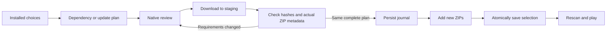

# Native dependency installs and updates — build25

Status: all local gates pass; all seven iCloud kit files are confirmed uploaded.
Physical build25 download/execution and acceptance are pending.
Source: `experiments/ios-jit/launcher-dependencies`, 0.13.0 (25).
Build24's [phone acceptance](BUILD_24_GRAPHICS_ACCEPTANCE.md) clears the graphics,
resume, Quit and fresh-process save gate. Its exact managed payload, native
renderer and JIT runtime are reused read-only.

## Agreed scope

- Neutral Celeste profile presentation, installed mod library and dependency review.
- Exact Everest identities/version rules; retain compatible installed versions,
  offer disabled dependencies, verify whole original downloads and actual metadata.
- Download bytes/file progress, cancellation retaining verified files, re-review
  changed metadata, stale-library checks and recoverable all-file transactions.
- The owner added an Updates page during this implementation: show installed and
  indexed versions, individual updates and Update all, always through a reviewed
  plan. Preserve disabled status and app-managed compatibility versions. Never
  silently update unrelated dependencies or the desktop runtime.
- Existing installed game content, mod archives, complete saves and profile path
  stay in place. No game/mod reimport is planned. Main-menu Quit remains normal.
- Browse/search catalogue, animated boot, profile backup UI and touch editor remain
  later increments. A public original-IL/FMOD release remains a separate gate.

## Update checks

The owner also requested an explicit Check for updates button and occasional
automatic checking. The Updates page checks at most once per 24 hours after a
successful check while idle, with a Settings opt-out and one-hour automatic
failure backoff. Manual checks remain available. Results are cached per library
revision, and archive xxHash values are cached against their verified SHA256.
There is no timer during gameplay and no automatic ZIP download/install.

## Implementation decisions being tested

Online YAML uses its own bounded per-record parser; per-ZIP limits stay unchanged.
Downloads use HTTPS URLSessionDownloadTask to private disk staging, validate the
index's xxHash64 seed-zero integrity check and retain local SHA256 provenance.
Actual ZIP requirements override provisional online graph metadata; changes
require another review. Built-in support/runtime identities cannot be replaced.

An install adds verified new archives and atomically changes the single mod-state
file. Prior ZIPs remain disabled and retained. A durable journal precedes all
renames; startup rolls back an incomplete operation or recognizes the completed
state before library scanning or game startup. This is not hot mod unloading.

Required tests: real current index and original ZIPs; versions/pins/multi-module
sources, optional dependencies, conflicts/cycles, explicit updates, disabled
updates, same-version repacks, stale revisions; cancellation/network/hash/metadata
and disk failures; process interruption at commit boundaries; real native UI,
package and protocol validation; unchanged game payload regression identity.

The completed host evidence and phone instructions are described below.

## What is implemented

`DependencyInstaller.swift` runs work on one serial worker. UIKit remains
responsive; a URLSession download delegate streams to private disk staging.
The host freezes mod mutations while work is active or after the game has used
this process. Plans identify the exact inventory revision and are revalidated
before applying. Mod ZIPs are never extracted wholesale by the installer.

`DependencyPlan.swift` keeps compatible active dependencies, proposes enabling
an installed compatible ZIP, and downloads only when needed. It handles
required and present optional dependencies, numeric Everest versions, duplicate
providers, cycles and multi-module archives. An explicit update is never silently
reverted to the previous version to satisfy another mod. Updating disabled mods
keeps the replacement disabled and does not activate their dependency graphs.
Mixed enabled/disabled targets sharing one replacement ZIP are blocked for review.

`ModUpdates.swift` shows exact installed/latest versions, archive changes under
the same version, per-mod actions and Update all. A published update can be
visible but unavailable when it requires a newer built-in runtime. Recovery
copies are hidden behind an explicit toggle and excluded from Update all and
bulk Enable all. Compatibility-pinned GravityHelper, CollabUtils2 and FemtoHelper
remain app-managed. Bundled CelesteIOS and the desktop runtime cannot be replaced.

`InstallJournal.swift` adds new files, then atomically changes the single
`launcher-mod-state.json`. It never overwrites old ZIPs or touches save data.
A journal is synchronized before the first rename. On startup, incomplete work
is rolled back or an already committed selection is recognized before scanning.
Changed/unknown files or conflicting state are retained and block recovery rather
than being overwritten. Complete verified downloads survive cancellation; only
UUID-named incomplete staging files are discarded on the next operation.

The native launcher now uses neutral Celeste wording, Installed/Updates pages,
review/progress/cancellation sheets, and actionable launch/import/selection
alerts. Ordinary in-game Quit, touch controls, diagnostics Export and the existing
profile path remain. `mod_installations` in exported diagnostics contains recent
bounded receipts with archive SHA256, published hashes, source URLs, selection
identity and recovery outcomes. Full receipts remain in the profile.

## Service contracts and new findings

The captured index and graph each contain 6,166 identities. The parser accepts
6,151 of them; 15 have invalid numeric versions and remain explicitly unavailable
to automatic planning. This is an observed snapshot, not a permanently fixed
catalogue count. Index and graph URLs must agree for a candidate. Both payloads
and the official pointer locations are retained with SHA256 and fetch time.

The backend emits `NoVersion` for an omitted dependency Version. Everest defaults
that property to `1.0`, so the online parser maps only that sentinel to the same
default. Actual fetched `everest.yaml` is independently validated. See the
[backend parser](https://github.com/maddie480/RandomBackendStuff/blob/904284430da1e72218696cac6e4d0aebea663d1a/src/main/java/ovh/maddie480/randomstuff/backend/celeste/moddatabase/EverestYamlProcessor.java)
and [Everest metadata](https://github.com/EverestAPI/Everest/blob/4bbde91b8dbaaddef2ceec75ca0cd6d59b3b8d00/Celeste.Mod.mm/Mod/Module/EverestModuleMetadata.cs).

Downloads follow the indexed archive's size and xxHash64 seed-zero checksum,
then record a local SHA256. These checks establish downloaded-byte integrity;
xxHash is not a publisher signature. HTTPS, redirects, request timeouts, expected
length, file bounds and actual ZIP identities are checked. The implementation
was checked against the published [XXH64 specification](https://github.com/Cyan4973/xxHash/blob/v0.8.3/doc/xxhash_spec.md)
and a separate Python xxhash implementation, plus real published archives.
Everest's [mod updater](https://github.com/EverestAPI/Everest/blob/4bbde91b8dbaaddef2ceec75ca0cd6d59b3b8d00/Celeste.Mod.mm/Mod/Helpers/ModUpdaterHelper.cs)
is the service-contract reference; this app owns its own installation transaction.

The real original test corpus exposed these updates:

| Module | Installed | Indexed | This app |
|---|---|---|---|
| EeveeHelper | 1.12.5 | 1.12.6 | Available; downloaded/installed in the host test |
| FrostHelper | 1.80.1 | 1.80.2 | Available; downloaded/installed in the host test |
| ExtendedVariantMode | 0.50.5 | 0.51.0 | Requires Everest 1.6531.0; unavailable with 1.6458.0 |
| MaxHelpingHand | 1.40.9 | 1.40.10 | Requires Everest 1.6531.0; unavailable with 1.6458.0 |

The two available updates total 1,424,816 bytes. Both original archives remain
disabled alongside their replacements: 53 enabled ZIPs / 55 installed in this
isolated full-corpus test. All 53 original archives remain byte-for-byte intact.
The current phone has additional imported examples/mods, so its counts may differ.

## Validation evidence

- 534 planner/version/hash/index assertions, including the full original 53-ZIP
  selection and independent hash vectors at many chunk boundaries.
- 13 coordinator assertions: actual ZIP requirements force a second review;
  disabled replacement stays disabled; same-version repacks; failed integrity;
  partial cancellation; verified-file reuse; corrupted cache replacement.
- Seven automatic-check policy assertions: cached page visits perform no network
  fetch, opt-out works, 24-hour expiry, manual bypass, one-hour failure backoff,
  and zero mod downloads during availability checks.
- Nine journal cases, including process exit after the journal, each ZIP move
  and the state commit; injected disk errors; tampered staging and stale plans.
  Three additional recovery cases preserve unknown changed files/state and reject
  an invalid journal path. Unknown save/sidecar bytes remain unchanged throughout.
- Five real HTTPS checks, including MemorialHelper's published size/hash and
  metadata, oversize rejection and an expected-length mismatch.
- The original native mod-library suite passes all 42 checks.
- Real EeveeHelper/FrostHelper downloads pass one reviewed transaction on the
  complete original corpus. No update is fabricated or substituted for these tests.
- Actual Mono/Metal then passes Paint's original Lua intro, retained texture and
  backbuffer checks, input/resume and complete session shutdown with those updates.
  Metal API validation is enabled, four graphics-contract and 37 session-contract
  checks pass; the existing test sidecar loads8, saves16 and reads16 back.
  This establishes the tested host route, not all-map or physical ARM64 acceptance.

The first host driver invocation omitted the external Paint fixture while still
asserting its completion marker. The game returned and saved, but that incomplete
validation was rejected. The corrected invocation explicitly includes the fixture
and passes its Lua completion marker. The first XCUITest pass found an offscreen
Export button in the test's landscape Settings navigation; the test now scrolls
the native form to the button. No phone crash is inferred from either harness issue.

Exact final UI, package, request protocol and handoff results are recorded in
`MOD_INSTALLS_BUILD_25_EVIDENCE.json`. New checks bind their source hashes; the
unchanged game payload and original graphics/session matrices are inherited by
exact build24 identity. The entire AOT checkout and accepted build24 stages are
preserved. No commit, push, GitHub write or public release was performed.

## Scope limits and next decisions

Online graphs describe their indexed release, so installing an older arbitrary
import still depends on its actual YAML and compatible available releases. An
unknown/invalid entry is not resolved by GameBanana title guessing. Installs have
file/count/byte limits and do not offer arbitrary desktop native plugins.
Verified complete ZIPs are resumable across retries; partial HTTP byte-range
resume is not implemented. A very large fresh library can require a first
background-worker hash pass; later checks reuse SHA-keyed xxHash results.

The phone acceptance gate is the dependency review, updates UI and downloads,
retained choices, gameplay, normal Quit and fresh-process saved progress described
in the handoff README. Keep build24 as fallback until that gate passes.

The new runtime-version finding raises a backend follow-up before promising
broader fresh-profile installs: assess an isolated Everest runtime update with
all compatibility/save/graphics gates. Never weaken dependency checks or install
a desktop runtime inside the active process to make a row appear compatible.
Once build25 is accepted, choose that bounded runtime update alongside the next
native loading-progress step; browsing, whole-profile backup/restore and the
full-parity touch editor remain documented future increments.

## Final local package

All four final XCUITests pass, including real picker persistence, launch alerts,
update review/cancel/install and Export. A separate settled landscape check also
passes; screenshots taken during rotation are excluded from the visual review.
The unsigned IPA is 23,409,096 bytes. SHA256:
`27885f04db1dd6926f78106cca5e8e4e7c4e3059c3ccd3fb10cffdc1b8e07ba4`.
Executable/dSYM UUID: `9160ACFD-56F9-360A-A765-92A4A68065CD`.
All 198 final source inputs match the simulator build. The packaged request and
script pass their protocol checks; symbols and simulator fixtures are outside
the device payload. Exact cloud state is recorded separately in the evidence
ledger and artifact delivery receipt.

## Final delivery — 13 September 2026

The phone kit is **23,428,401 bytes / seven files**, confirmed uploaded to
`iCloud Drive/Celeste JIT Tests/0.13.0-build-25`. It contains the unsigned IPA,
README-FIRST, INSTALL, reference script template, notices, exact test identity
and a phone-only SHA256 manifest. The build ID retains its 12 September start
date: `launcher-dependencies-20260912-25`.

Install as an update in LiveContainer slot1, retaining data. Keep Launch with
JIT off, the saved script blank and Fix File Picker on; StikDebug remains in
slot2. Test dependency review and the Updates page before starting the game.
Use a fresh inline JIT request, play and quit normally, then repeat in a fresh
process to verify saved progress. Export both sessions to this kit's Results.
The [complete phone guide](../../artifacts/ios-jit/launcher-dependencies-20260912-25/README-FIRST.txt)
describes the small dependency and update cases; no original game ZIP or large
mod download is required for this test.

The private frozen snapshot is
`.build/ios-jit/device-evidence/2026-09-13/build-25-ready`. Its receipt SHA256 is
`b965e4bc55ea3c4d103d31dd56b1046b7269c67682e65112bf3a4347f04c70fe`:
1,621 new files and 154 matching inputs inherited from a verified 20,335-file
build24 tree. Final delivery records and updated documentation are preserved
separately in its handoff folder; the frozen source, IPA and symbols are unchanged.
Further code corrections require a new build identity.

Every delivered file was read back by SHA256; Apple's resource metadata reports
uploaded with no error. This confirms cloud upload, not phone download or a
physical PASS. Build24's cloud fallback was byte-verified. Only the superseded
build23 cloud IPA was removed after checking its exact retained local copy;
all 47 Results paths and all local installers/symbols remain. No commit, push,
public release or AOT-checkout edit was made.
